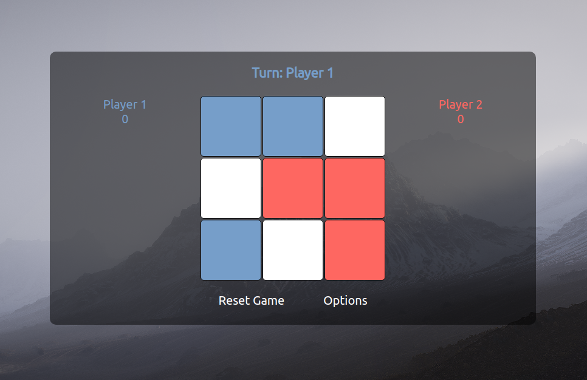

# Tic-Tac-Toe-Game

click here to play: https://allisonbarnaud.github.io/Tic-Tac-Toe-Game/

1. HOW TO PLAY

TIC TAC TOE is a game of strategy: Each player takes a turn to choose a space on the 3x3 grid. The goal is to occupy 3 spaces in the same row, column or diagonally.

to start the game, find a friend, choose your names under the options tab and take turns clicking.

Good luck!

2. DEVELOPMENT

Technologies used: HTML, CSS, Javascript

my first approach was to list all basic features to have a working game:
features:
- 3x3 grid, size accurate and customizable
- clickable boxes, adding a label (class) on each box
- player switching system
- score tracking after every win/loss
- reset system
- a "check for win" system running on every turn

My main goal was to have working logic code. All other features and aesthetics would be handled later if time permitted. 

I started off by setting up my HTML and structuring my elements as best I could. 

Afterwards, moved on to the Javascript:
- Firstly a system to check for clicks on the boxes.
- Inputting those values into an array, then splitting it between inputs of player 1 and player 2.
- writing a loop to check against all possible win states (8 in total).
- stopping the game when a win state has been found
- declaring the winner.

The code above was the most challenging part of the project to me. Everything else was reasonably straight forward, but took a fair bit of time.

the logic for "checking for a win" goes as follows: 
- on each click, add a class to the clicked box with the corresponding player name
- push those classes into an array, representing the 9 boxes, to keep track of who clicked where.
- add the index of each player into 2 separate arrays.
- check those two arrays against an array of arrays of all possible win situations, using ".includes"
- if one of the two player arrays has one of the possible solution combinations, that player wins!

The next steps were to add more features and beautifying the website:
- options menu
- win overlay
- name change feature
- aesthetics
- CSS structuring for adaptability
- audio

3. ISSUES
	1. Fixed: 
	- several issues with updating the names of the players, due to not calling the DOM updater 	functions in the correct places
	- The logic behind checking for a win was overall a challenge, particularly sorting all the 	different arrays to use that data effectively without having to check one by one.
	- the HTML was difficult to sort out, the website would have issues when the window was a 		different size. I had to use percentages and absolute positions to place things accordingly.
	
	2. Not yet fixed
	- A few features are still in early stages of development therefore were omitted:
		- color choosing for players
		- mute button
		- timer feature for each player turn (if timer runs out, automatic loss)
		- mobile support
	
4. CHALLENGES/LESSONS LEARNED

The amount of code I wrote was higher than I had anticipated, and became quickly overwhelming at times. Knowing that now I would have structured my code and functions more efficiently to ensure better legibility and ease of adding new features.

More preplanning, good understanding of the features to be added by the end, would have helped me manage scope and timing better.

The CSS was quite a challenge to organize properly. I had to look into a fair number of new techniques to better organize the elements the way I wanted.

